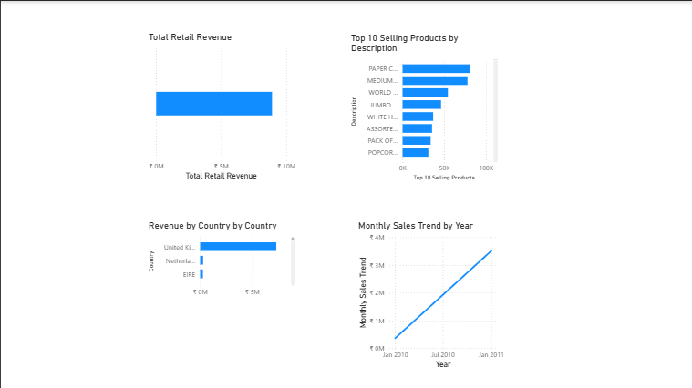

# Retail Intelligence Platform

## Project Overview
The Retail Intelligence Platform is a data analytics project designed to analyze retail sales data and generate business insights. The system processes raw retail transaction data, performs data cleaning and transformation using Python, and visualizes key insights through a Power BI dashboard.

## Technologies Used
- Python
- Pandas
- Matplotlib
- Power BI
- Git & GitHub

## Project Workflow
1. Data Extraction – Load raw retail dataset
2. Data Transformation – Clean and preprocess the data
3. Data Analysis – Generate sales insights using Python
4. Data Visualization – Create interactive dashboards using Power BI

## Key Insights Generated
- Total retail revenue
- Top selling products
- Revenue by country
- Monthly sales trend

## Dashboard Preview

